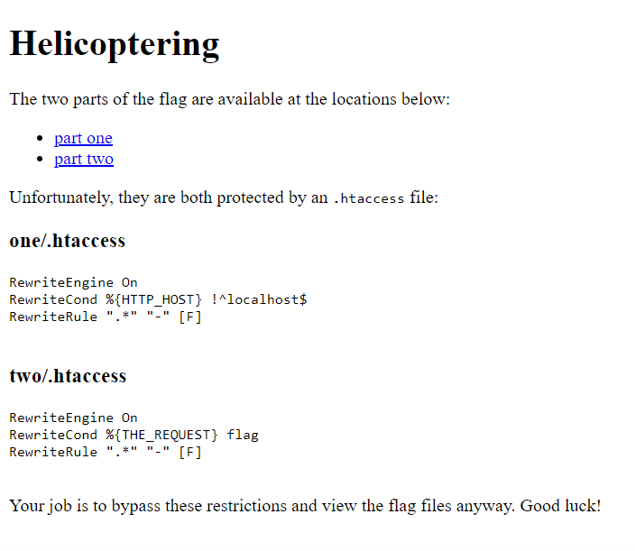

# Helicoptering

Utmaningen består av en enkel webbsida, med två länkar till .txt-filer med varsin del av flaggan. Man får också veta att dessa filer är skyddade av varsin .htaccess-fil, vilka används av webbservern Apache för att införa olika regler för access till respektive mapp.


Båda .htaccess-filerna använder sig av mod_rewrite-modulen, vilken kan ändra i http-requesten innan den slutligen utvärderas. I båda fallen skrivs allting (.*) om till ”-”, vilket gör att man inte kommer åt filen. Däremot finns även en RewiteCond, som definierar regler för när RewriteRule ska tillämpas. 

## Fil 1
I första fallet utvärderas HTTP_HOST, dvs Host-headern in requesten. Denna sätts av webbläsaren till domännamnet för den sida man försöker nå. Villkoret här är att omskrivningen körs så länge HTTP_HOST inte är exakt ”localhost”. För att kunna komma runt det måste vi därför andra Host-headern, vilket inte kan göras genom webbläsaren. För sådana här enkla saker är det enklast att använda sig av curl (även om ex BurpSuite hade fungerat utmärkt). Så vi kopierar länken till part_one, och kör:
```
curl -H "Host: localhost" http://34.87.217.252:30026/one/flag.txt
```
Vilket ger oss första delen av flaggan: `DUCTF{thats_it_`

## Fil 2
Den andra regeln kör överskrivningen om THE_REQUEST, dvs själva `GET … HTTP/1.1`-raden innehåller `flag`, vilket det ju verkar som att den måste göra eftersom det är den filen vi ska komma åt. Efter att ha läst lite om RewriteCond ser man dock att den utvärderas innan eventuella escape-koder avkodas. Då kan man enkelt kolla upp att t ex bokstaven `f` kan escapeas med `%66`. Vi kör curl igen med denna ändring:
```
curl http://34.87.217.252:30026/two/%66lag.txt
```
Och får andra delen av flaggan: `next_time_im_using_nginx}`