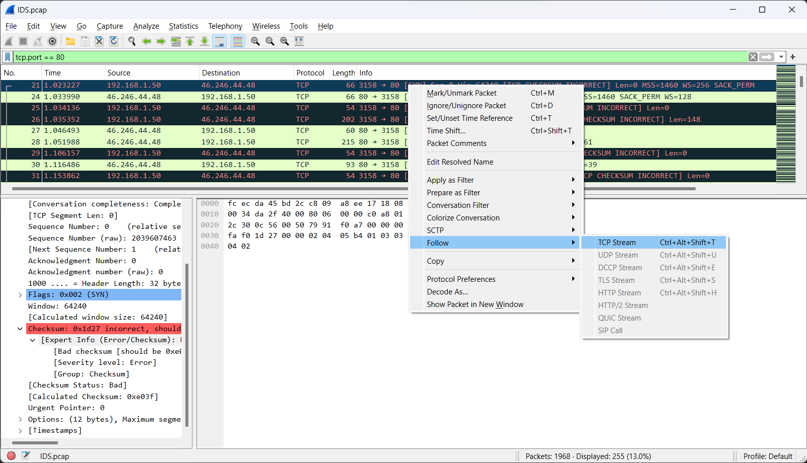
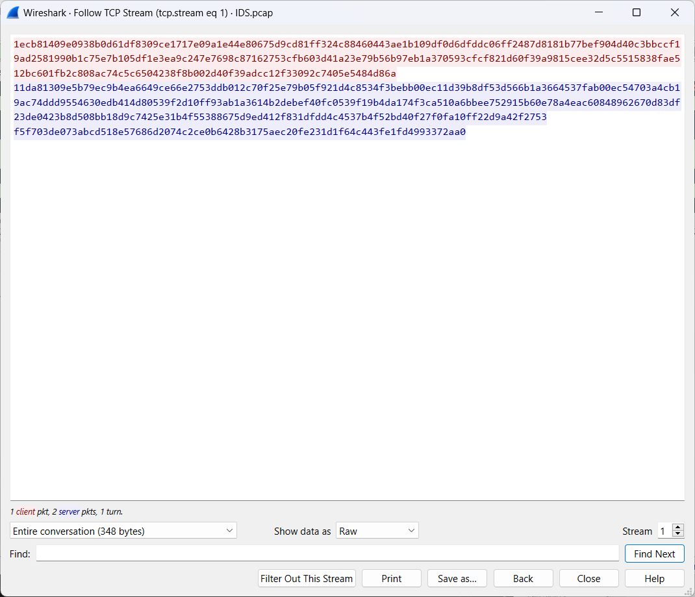
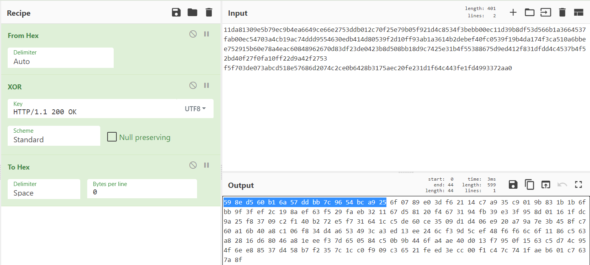
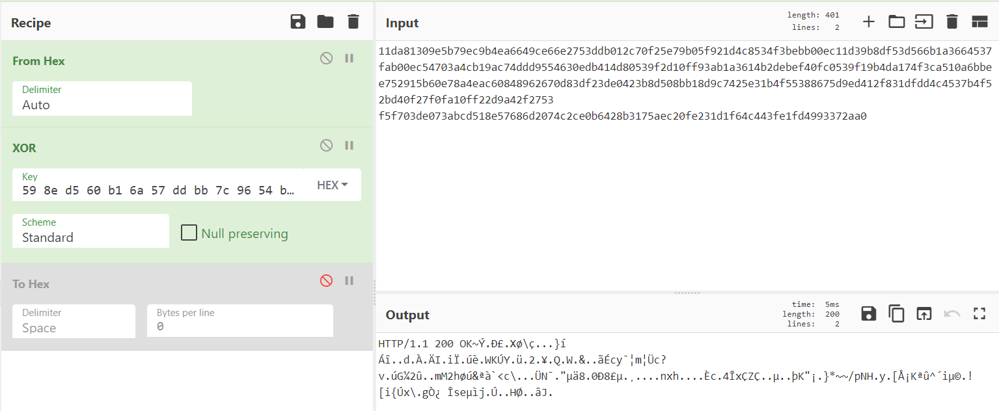
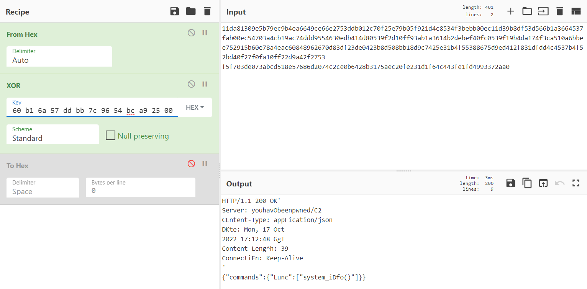
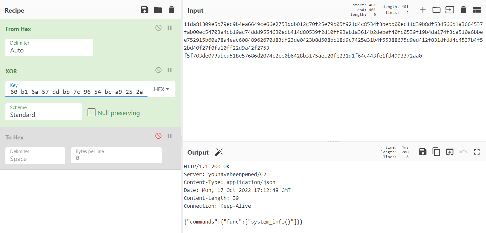
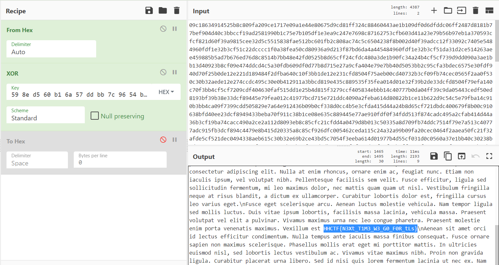

# Flagged by IDS

## Challenge description

Our IDS flagged some traffic from this computer, it has probably been infected by some kind of malware. Initial analysis shows it uses a simple encryption, possibly it just XOR the HTTP traffic with a static key.

We need you to find out what the key is, and then identify if any sensitive data has been leaked.

## Solution

We are given a pcap file with quite a lot of traffic, but can quite easily identify two interesting hosts which communicate a lot: 192.168.1.50 and 46.246.44.48. The latter can also be identified by a DNS query for `youhavebeenpwned.net`.

Since we know that we're looking for http-traffic we can filter on port 80, select one of the packets and follow that tcp stream, which will show the complete (encrypted) http request and response.

Selecting "Show data as: Raw" gives us the hex data, which can be copied to CyberChef where we can start decrypting. Since it's a simple XOR cipher it's vulnerable to partially-known-plaintext-attacks. Since it's suspected to be plain HTTP-traffic, we can use the fact that we probably know how parts of the message looks. In the image above, we can assume that the red data is an HTTP-request, and the blue is a response. Assuming the request was successful, the response should begin with the string `HTTP/1.1 200 OK` followed by more headers, though we cannot know which, or in what order.

What we do is that we XOR the encrypted data with the known plaintext. Since XOR is a reversible operation the first 15 bytes of the result should be the first 15 bytes of the key.

We copy the first 15 bytes and give that as input to the XOR operation instead.

This gives us the correct plaintext output in the beginning, but this would be true even if that wasn't the original plaintext, since we just reversed the operation. The problem is that we don't know the length of the key. What we do then is to add 0-bytes to the end of our key. If it is correct we should see other parts of the plaintext once we have reached the key length (or a divisor of the key length).

It appears that the key is 16 bytes, since adding just one zero-byte made an almost complete decryption. We can now add the fact that we know HTTP uses `CRLF` as line ending, so the last byte should be `'` XOR `CR`, which is `0x2a`! Inputting that instead of the zero-byte completely decrypts the message.

Now we just need to find the request that contains the flag. After browsing through the requests/responses we find it in the request of TCP stream no 46.

Flag: HHCTF{N3Xt_T1M3_W3_G0_F0R_tLs}
