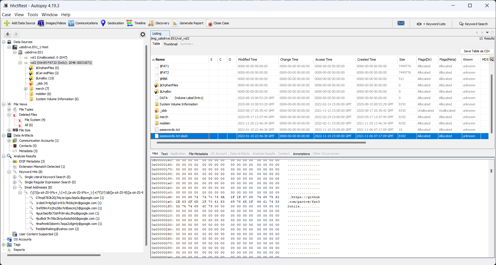
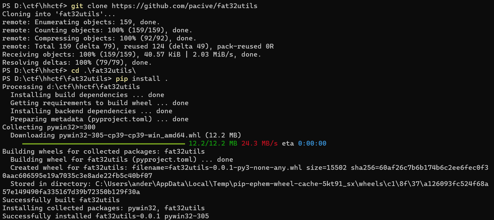
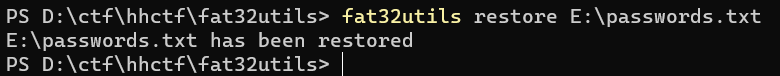
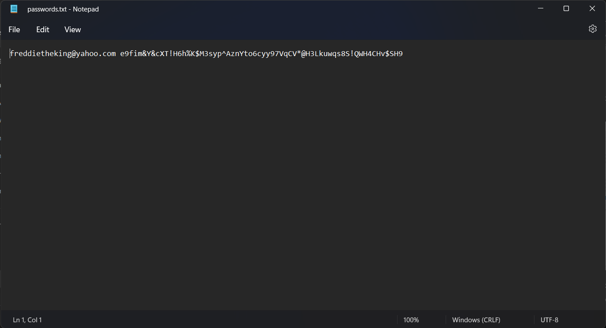
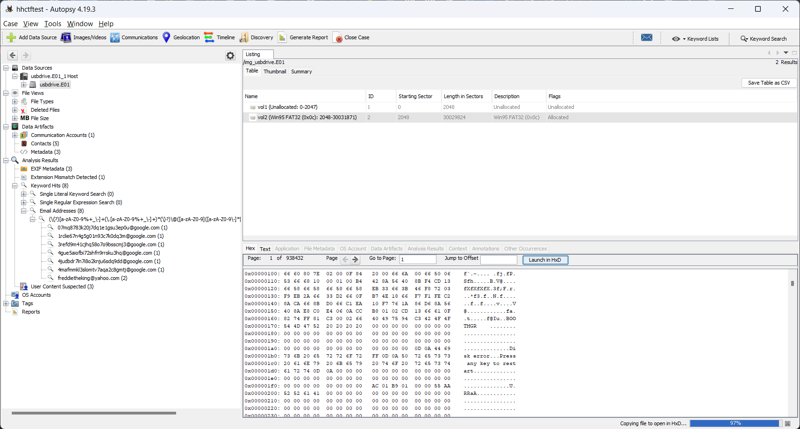
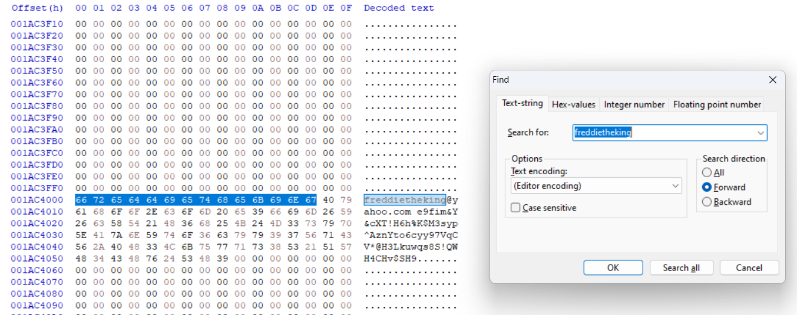

# Lost password

## Challenge description

We confiscated this USB drive from a drug dealer we arrested. We need to get the password for his email account, but it seems that the file has been altered or hidden in some way. Can you recover it for us?

The flag format is HHCTF{PASSWORD}

## Solutions

We are given an e01 file - a forensic image of a storage medium, in this case a usb drive. There are several possible solutions to this challenge. The password file is as stated in the description hidden somehow, the task is to find it or restore it in some way. Two different ways will be described here.

## Solution 1

Opening the file in e.g. Autopsy reveals a github link in the slack space of the password.txt file.

By looking at the github repository, it can be assumed that this tool has been used to hide the file. To install the tool, we can clone the repository, and install it via pip. Note that the tool only works in windows.

But to use the tool, the image needs to be mounted as a fat32 filesystem. This can be accomplished using [OSForensics OSFMount](https://www.osforensics.com/tools/mount-disk-images.html). Then we can run fat32utils to restore the file.

Then we can open our newly mounted drive via explorer and read the file.

## Solution 2

We are asked to find the password for his email address. This can be found e.g. via a keyword search in Autopsy. The email is `freddietheking@yahoo.com`. By opening the entire drive in HxD, we can do a text search of the entire drive.

Flag: `HHCTF{e9fim&Y&cXT!H6h%K$M3syp^AznYto6cyy97VqCV*@H3Lkuwqs8S!QWH4CHv$SH9}`

## Explanation

The file has been hidden using the fat32utils tool. What the tool does is to alter the file entry in the directory to point to a different cluster on the drive. This new cluster is allocated in the File Allocation Table, and information on where the original file is located is written to the new file. The original file is still allocated and present on the drive, but no file entry points to it. Interestingly, this seems to make forensics applications totally overlook the file, it is not listed as a file (neither present or deleted), and is not present in unallocated space either.