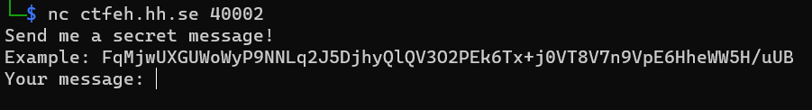
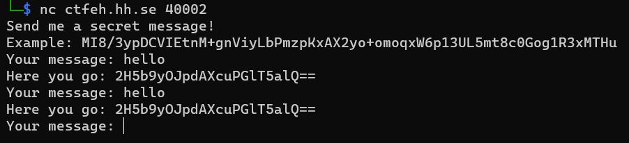
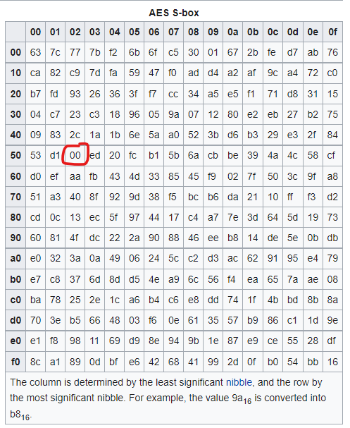

# LAES 2

## Challenge description

Now that you have solved the decryption I have created a service where you can send me secret messages! It creates a new random key on every connection, so it's super secure!

## Solution

We are given a host and port to connect to via netcat. 



The service encrypts strings using the LAES encryption, so after solving LAES we should be able to decrypt a message if we know the key. The example is presumably the encrypted flag. If we close the connection and reconnects, the example is different, so it uses a new key every time. However, if we send the same string multiple times in the same session, we get the same output, so the same key is used for the entire session.



By analyzing the algorithm, we can deduce that if we encrypt a string using 16 of the same characters, it would survive both the ShiftRows and the MixColumns steps. Additionally, if the data is all zeroes, when XORing with the key, the output would be the key!

This leaves the SubBytes step. To get all zeroes after this step, we need to send the character that gets substituted with `0x00`. [Wikipedia](https://en.wikipedia.org/wiki/Rijndael_S-box) has en example of the AES (Rijndael) S-box, where we can see that the byte we're after is `0x52`, the letter `R`.



So we send the string `RRRRRRRRRRRRRRRR` to the service, the output is the encryption key, which we can feed into our decryption algorithm to decrypt the flag.


```python
laes = LAES(base64.b64decode('9zse/v4SWJNHROaWhAEX2A=='))
print(laes.decrypt(base64.b64decode('MI8/3ypDCVIEtnM+gnViyLbPmzpKxAX2yo+omoqxW6p13UL5mt8c0Gog1R3xMTHu')))
```

Flag: `HHCTF{15_7H47_wH47_7h3_R0uNd5_4R3_4b0U7?}`