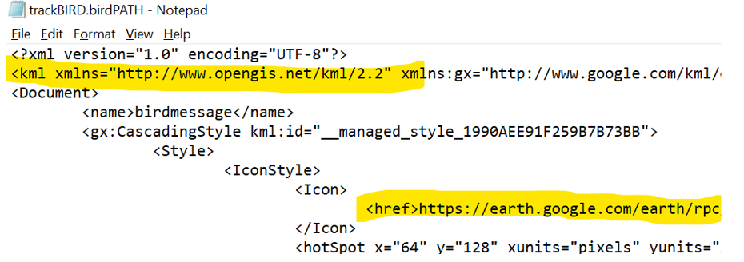
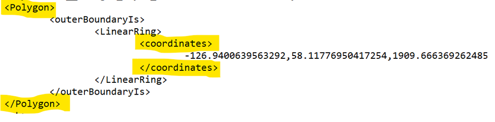
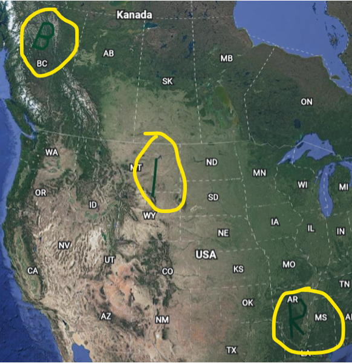
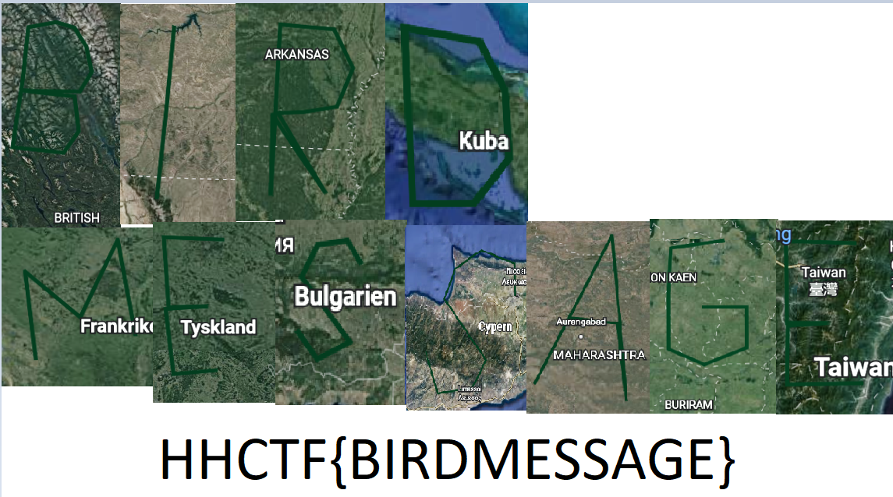

# I'm a cryptic bird

## Challenge description
We put trackers on a number of birds all over the world to see their flight paths. After collecting and analyzing the data we could conclude that they had very weird flight-paths. Are our feathery friends trying to tell us something?

## Solution
Since there is no file extension named birdPATH we start by simply examining the file's content in a text editor and see if it reveals something useful. Upon closer inspection of the contents we are able to tell that it is a KML-file containing polygons with geographical coordinates attached to it.  

A quick google search reveals that these coordinates can be graphically visualized on a map if imported to Google Earth. When the KML-file has been imported, each polygon will be shown in a list (picture does not show all polygons). Pressing the icons within the yellow box will display their geographical position on the map.

Each polygon from the list represents a alphabetic letter. 

Combining them in the correct order, starting with the polygon at the top of the list, will get you the flag.

