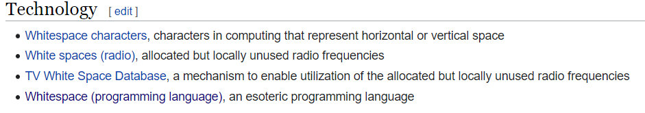
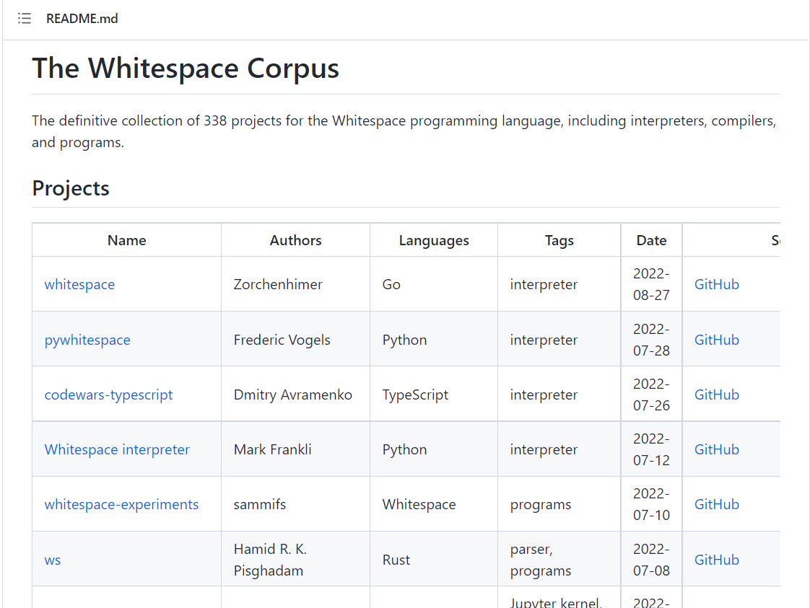

# Whitespace

## Challenge description

My colleague is not a fan of python. To prove his point, he messed up the [whitespace](https://en.wikipedia.org/wiki/White_space) in one of my scripts, so now it won't work.

## Solution

We are given a python file which, as said in the description, doesn't work, it fails with `TabError: inconsistent use of tabs and spaces in indentation`. By inspecting the code, we can see that it doesn't do anything useful (for us), it just calculates various statistics from the input. But in the decription we get a link to wikipedia, where we can see that there is a programming language called whitespace, which uses only spaces, tabs and newlines.



By following some links, we can see that there are a number of interpreters we can choose from.



We download the one called pywhitespace, but it seems to only execute some statically defined programs (and fails at that as well). We modify it a bit to execute our file instead, which will give us the flag.

```python
with open('statistics.py') as f:
    print(whitespace(f.read()))
```

Flag: `HHCTF{Wh1735p4c3_c4n_h4v3_4_d1ff3r3n7_m34n1ng}`
