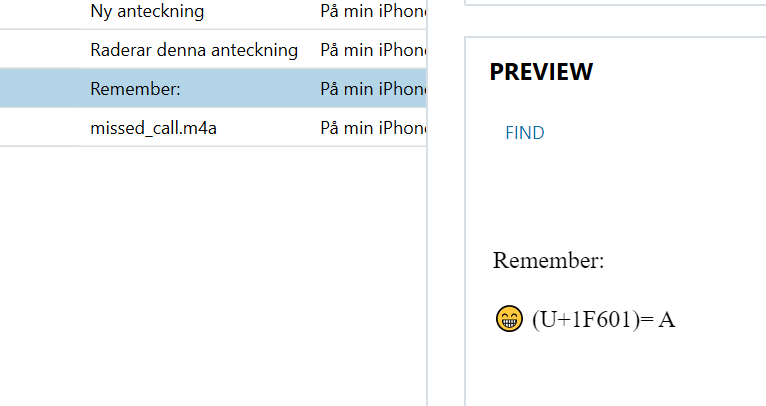

# Drugman
Solves: 1 <br/> Points: 300

## Challenge description

A conversation shows that a buyer wants to get his hands on a specific drug. Can you figure out which drug it is?

Flag format: HHCTF{NAME_OF_DRUG}

## Solution

In the "iOS iMessage/SMS/MMS" subcategory under the "COMMUNICATION" category, we find the conversation regarding a drug deal. If we read through the conversation, we find the drug that the buyer wants to get his hands on.


The drug is obfuscated by emojis. So the emojis 🐈🐈😆😒😁😇🤕🤢😅😙😕😖😉😡🤓 represent a specific drug. There is a hint in the "Apple notes" called "Remember" displaying this:



Remember:

😁 (U+1F601)= A

This shows that the last two numbers of the Unicode belonging to the specific Emoji is translated into the letter which has that position in the alphabet.

Example: The emojis 😈😅🤥 have the Unicode values U+1F608, U+1F605, and U+1F925. That is translated into HEY since H is the eighth letter in the alphabet and so on.

To get the corresponding Unicode value for each emoji the following website can be used. https://unicode.org/emoji/charts/full-emoji-list.html.

The website https://r12a.github.io/app-conversion/ can also be used to get the Unicode values.

The Unicode values we get from the emojis are `U+1F408 U+1F408 U+1F606 U+1F612 U+1F601 U+1F607 U+1F915 U+1F922 U+1F605 U+1F619  U+1F615 U+1F616 U+1F609 U+1F621 U+1F913`.


The drugname can be decoded either with a script or manually. Example of a script:

```python

UnicodeValues = ['U+1F408', 'U+1F408', 'U+1F606', 'U+1F612', 
'U+1F601', 'U+1F607', 'U+1F915', 'U+1F922', 'U+1F605', 'U+1F619', 
'U+1F615', 'U+1F616', 'U+1F609', 'U+1F621', 'U+1F913']
    
Values = []

for val in UnicodeValues:
    if val[5] == '0':
        Values.append(int(val[6:]))
    else:
        Values.append(int(val[5:]))

    
list_of_uppercase_letters = [
    chr(i) for i in range(ord('A'), ord('Z'))
]

Drug = ''

for i in Values:
    Drug += list_of_uppercase_letters[i-1]

print(Drug)
```

This gives the drugname HHFLAGOVESOPIUM.


**Flag:** `HHCTF{HHFLAGOVESOPIUM}`
