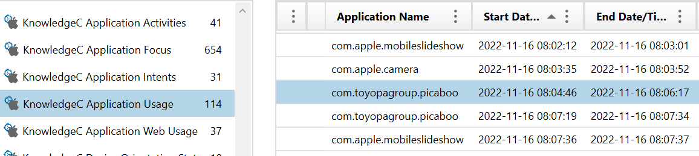

# Duration

Solves: 5   Points: 282

## Challenge description

Once you have figured out the answer to "Which app is it?" You may also be able to figure out how long the app was used for during this "session". Expected answer format is number of seconds

Flag format: HHCTF{Number_of_seconds} Example: HHCTF{69}

## Solution

We know that the application that was used was Snapchat (com.toyobagroup.picaboo), and that it was launched at Wednesday, November 16, 2022 8:04:46. If we go to the subcategory "KnowledgeC Application Usage" under the category "APPLICATION USAGE", and look for the entry with the Start Date/Time and Application Name that we already have, we can see that the End Date/Time is 2022-11-16 08:06:17.

If we subract the Start time from the End time we get the following result: 08:06:17 - 08:04:46 = 00:01:31. 1 minute and 31 seconds, which is 91 seconds.

**Flag:** `HHCTF{91}`
