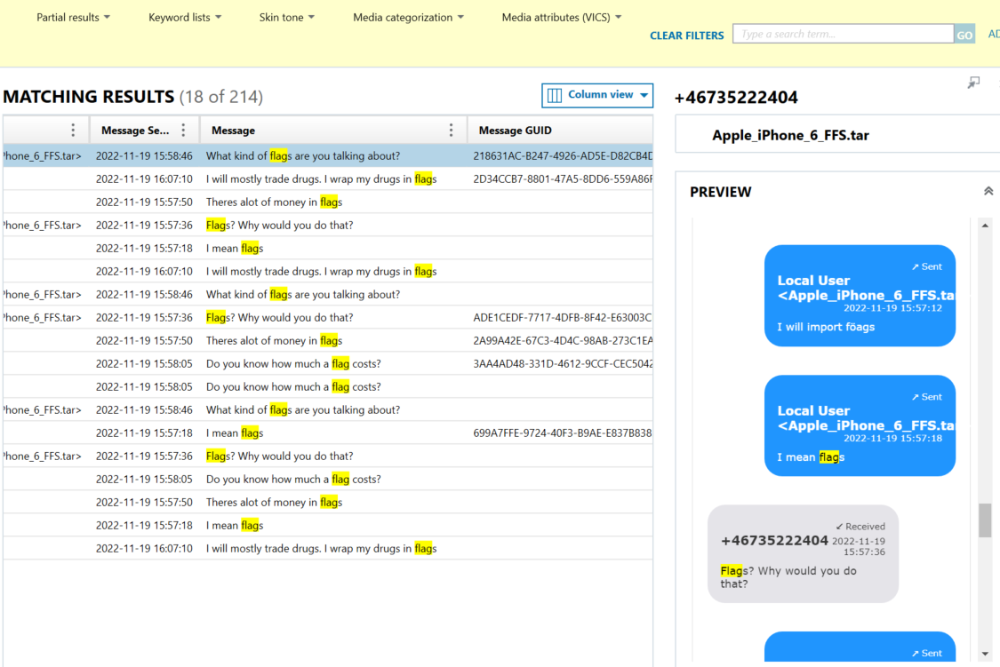
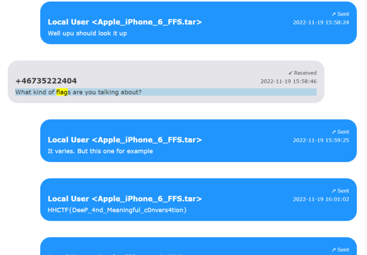

# Flagman

Solves: 19   Points: 138

## Challenge description

A conversation shows that the owner of the phone has a business idea about importing flags. He even gave an example of a flag. Can you find it?

## Solution

In the description we get a hint that a conversation mentions the word flag.

If we type "flag" in the search area, we get the following filtered results:

We find the conversation regarding the importation of flags. By reading the conversation we can see the flag in plain text, already wrapped in HHCTF{}.

**Flag:** `HHCTF{DeeP_4nd_Meaningful_c0nvers4tion}`
