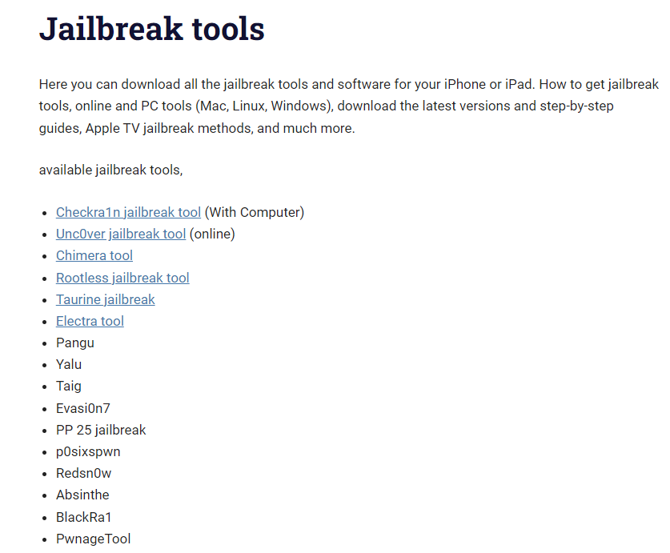
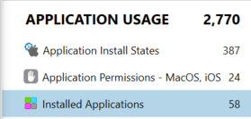
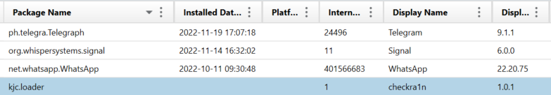

# Jailbreak

Solves: 13   Points: 216

## Challenge description

Which jailbreak tool was used on the phone?

Flag format: HHCTF{jailbreak_tool}

## Solution

Here you might need to look up some common Jailbreak software that can be used on an iPhone to get some knowledge about it.

https://zeejb.com/jailbreak-tools/ lists some available jailbreak tools.

The jailbreak tool that has been used on the phone is seen as an installed application. So if we go the category "APPLICATION USAGE" in the Portable Case file, we can see a subcategory called "Installed Applications".

Here we see some information about the installed applications, such as Package Name, Installed Date/Time, and Display Name. By going through the installed applications, there is an application with the Display Name "checkra1n". That name was also seen on the website, which means that checkra1n has been used to jailbreak the phone.

**Flag:** `HHCTF{checkra1n}`