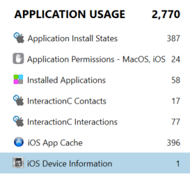

# OS version

Solves: 17   Points: 172

## Challenge description

What is the OS version of the phone? Here we want the full OS version, including the build.

Flag format: HHCTF{XXXXXX_XX_XX.X.X_(XXXXX)}

## Solution

This can be solved in a couple of different ways. We're going to present two solutions.

### Solution 1

By clicking on "EVIDENCE SOURCES" when we have opened the Portable Case file, we get the most basic information about the phone. Information such ass IMEI number, Serial Number, and Device Name. The OS version is also presented here.

### Solution 2

If we look at the artifacts instead, there is a category called "APPLICATION USAGE". Here we can see a subcategory called iOS Device Information.

This subcategory displays some information about the device which also can be seen in "EVIDENCE SOURCES". The OS version is also shown here.

**Flag:** `HHCTF{iPhone_OS_12.5.5_(16H62)}`