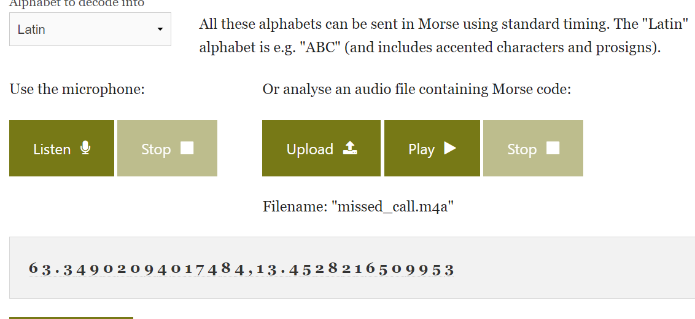

# Secret Meeting 1

Solves: 3   Points: 292

## Challenge description

A meeting was supposed to take place regarding a drug deal. What was the first location that was suggested?

Flag Format: HHCTF{Location}

## Solution

In the "iOS iMessage/SMS/MMS" subcategory under the "COMMUNICATION" category, we find the conversation regarding a drug deal. If we read through the conversation, the buyer asks if the seller "Can deliver here?", and sends a sound file containing morse code.

The file is located in the subcategory "Apple Notes" under the category "DOCUMENTS". So we just right click on the file missed_call.m4a, and save the artifact.

If we upload the file to a morse code sound decoder such as https://morsecode.world/international/decoder/audio-decoder-adaptive.html we can see that it represent coordinates.

The coordinates are:  
Latitude: 63.34902094017484  
Longitude: 13.4528216509953  

If we use those coordinates on Google maps, the following location is presented:

**Flag:** `HHCTF{Järpen}`
