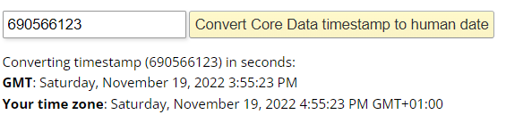
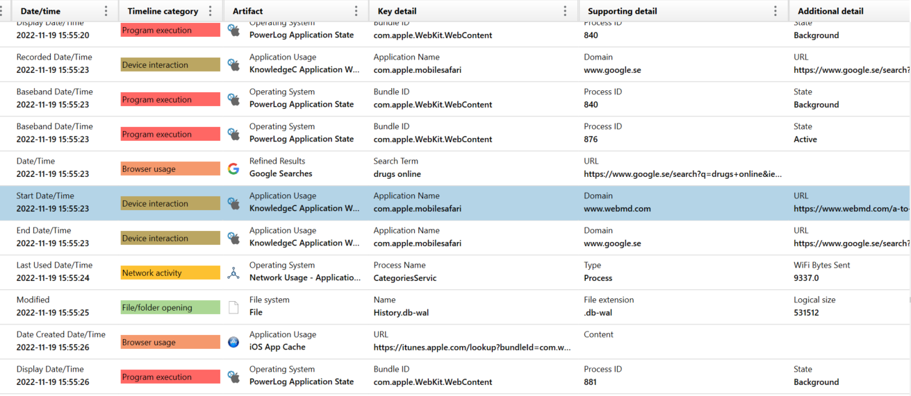
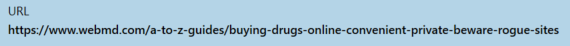

# Where was it (digitally)?

Solves: 7   Points: 268

## Challenge description

Safari was used to browse a website at 690566123. What was the visited URL?

Flag format: HHCTF{URL}

## Solution

Since we already know from "Which app is it?" that Cocoa core time is used and UTC+0 (GMT) is the time zone in Portable Case file. The human time is as follows:

Now that we know the timestamp, we can use the timeline function in the Portable Case file and choose the date 2022-11-19. If we go to the given timestamp, we can see the specific URL that was visited.

We can see that the visited site was "https://www.webmd.com/a-to-z-guides/buying-drugs-online-convenient-private-beware-rogue-sites".

**Flag:** `HHCTF{https://www.webmd.com/a-to-z-guides/buying-drugs-online-convenient-private-beware-rogue-sites}`
