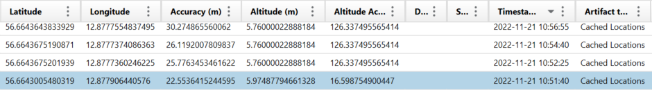

# Where was it (physically)?

Solves: 18   Points: 156

## Challenge description

Where was the suspects phone located at 2022-11-21 10:51:40?

Flag format: The address, HHCTF{Street_name_streetnumber}

## Solution

First, we need to find where the information about Locations are stored. In the Portable Case file there is a category called "LOCATION & TRAVEL. By clicking in that, we see a subcategory called Cached Locations.

Here we can see information such as Latitude, Longitude, and Timestamp Date/Time etc. Since we have the timestamp, we can order by Timestamp Date/Time and look for the entry with the matching timestamp that we have.

Now we have the coordinates for the location of the phone at 2022-11-21 10:51:40.  
Latitude: 56.6643005480319  
Longitude: 12.877906440576  

If we insert the coordinates in Google Maps, we get the following address:

The coordinates represent the street name Kristian IV:s Väg, and the street number 3.

**Flag:** `HHCTF{Kristian_IV:s_väg_3} (HHCTF{Kristian IV:s väg 3} was also accepted)`
