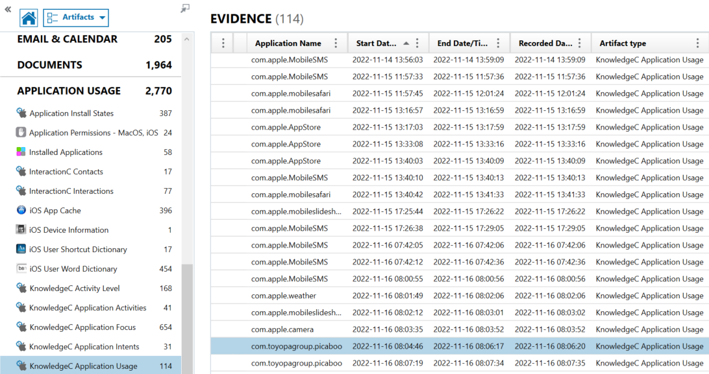

# Which app is it?

Solves: 9   Points: 250

## Challenge description

An app was opened at 690278686. What is the commonly used name of that app?

Flag format: HHCTF{Name_of_app}

## Solution

We get a timestamp which looks a bit like Unix epoch time, but if we convert it from Unix epoch time to Human date we get the following timestamp: Saturday 16 November 1991 08:04:46. This is way too early for it to be the right timestamp. So, if we google "Apple timestamp", we get the following result:

This means that the timestamp is in Cocoa core format. If we convert the Cocoa core timestamp to Human date, we get the following timestamp:

And since the time zone is UTC+0 (GMT) as standard in the Portable Case file, we will use the timstamp Wednesday, November 16, 2022 8:04:46. By going to the category "APPLICATION USAGE", there is a subcategory called "KnowledgeC Application Usage". KnowledgeC is a database that stores an event log of multiple processes that run within an Apple device. In the KnowledgeC Application Usage category there is information such as Application Name, Start Date/Time, and End Date/Time. If we order by Start Date/Time, we find out that the Application Name "com.toyopagroup.picaboo" was opened at that time.

Com.toyopagroup.picaboo goes under the name Snapchat. Picaboo was the former name of Snapchat, and Toyopa Group were the initial developers of the application.

**Flag:** `HHCTF{Snapchat}`
