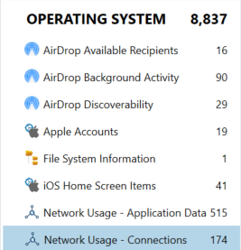
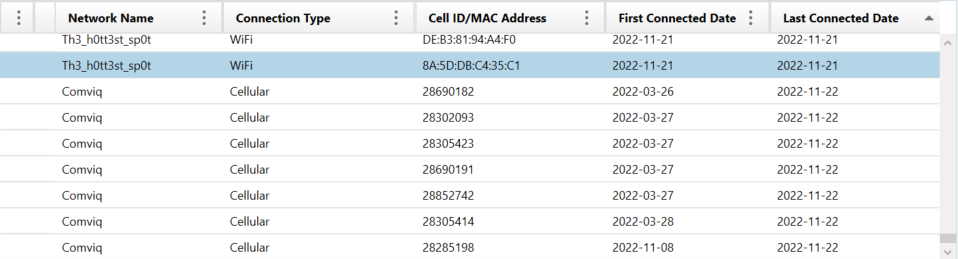

# WiFi

## Challenge description

What is the name of the WiFi network that the phone was last connected to?

Flag format: HHCTF{WiFi_network_name}

## Solution

First, we need to find where the information about Network Usage is stored. If we look at the "OPERATING SYSTEM" tab, we can see a category called "Network Usage - Connections".

Here we can see information such as Network Name, Connection Type, Cell ID/MAC Address, First Connected Date, and Last Connected Date. Since we already know it was a WiFi connection, we can order by Last Connected Date and look for the latest entry where the Connection Type was a WiFi connection.

Here we see that the last WiFi connection had the Network Name "Th3_h0tt3st_sp0t".

Flag: HHCTF{Th3_h0tt3st_sp0t}
