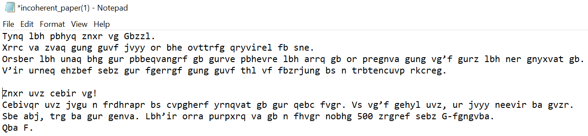
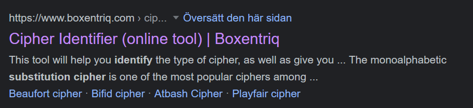
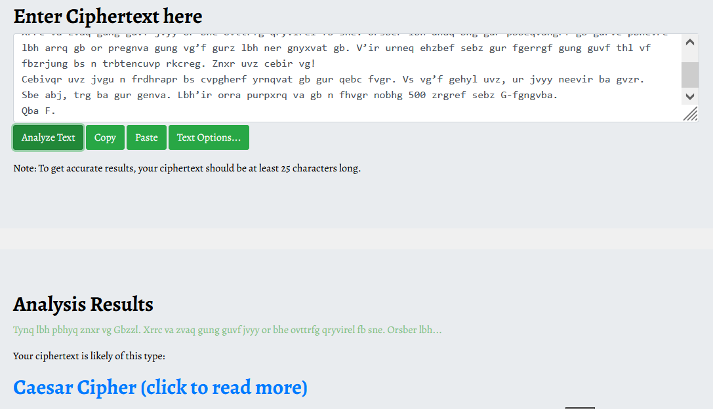
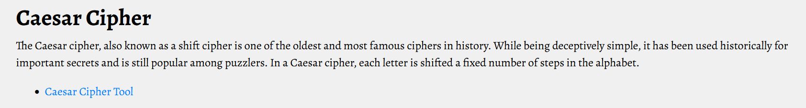
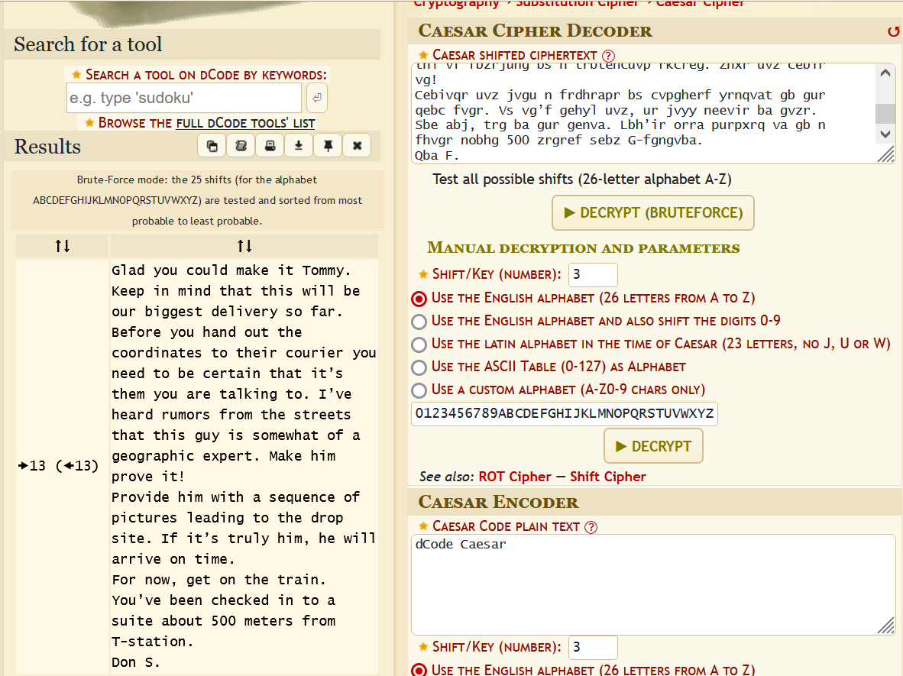

# Infiltrate The Mob - PART 1

## Challenge description
At 5:00am Friday the 9th of December you, a forensic expert, have been tasked to conduct a search warrant at a facility located on the outskirts of the city Järpen. The decision for conducting the search warrant is based on weeks of reconnaissance as well as solid proof from an inside-informant that a huge drug deal is about to happen between the notorious mobster Tommy "Tommy Gun" Angelo and another criminal organization.

At site, you and your team quickly realize that the premise has been wiped clean from all physical and digital traces. Nothing but two crumpled up pieces of paper could be retrieved from a garbage-can. One of the papers was identified as a train ticket. The other, just a piece of paper with lots of incoherent text. Upon closer analysis, you realize that these artifacts can be of great use in locating the person of interest.

## Solution
We begin by downloading both files for the challenge, one PDF-file containing a train ticket and one text file. The document "incoherent_paper.txt" contains lots of random texts, though it follows a structure as if it were to be readable text (example, dots end each line of text). We might be dealing with some sort of substitution cihper.

Using a substitution identifier tool it becomes evident that the text has been encrypted with a Ceasar cipher.

https://www.boxentriq.com/code-breaking/cipher-identifier#caesar-cipher

With a Caesar Cipher bruteforcing tool, which identified the cipher text as ROT13, we get the actual plain-text.  

https://www.dcode.fr/caesar-cipher

With the information retrieved from the decrypted message, in combination with train ticket, we are able to tell that the hotel should be located about 500 meters from Östersund Central trainstation. With the distance measuring tool from Google maps we find that the hotel "Best Western Hotel Gamla Teatern" is almost exactly 500 meters from the trainstation.

Entering the name of the hotel gives the correct answer!
