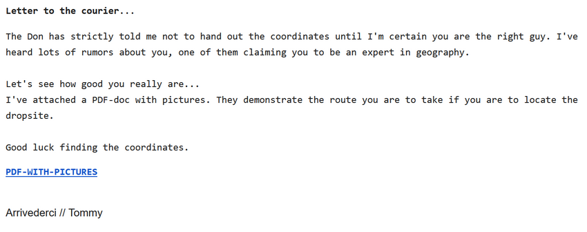
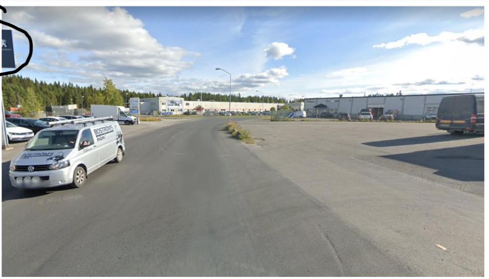
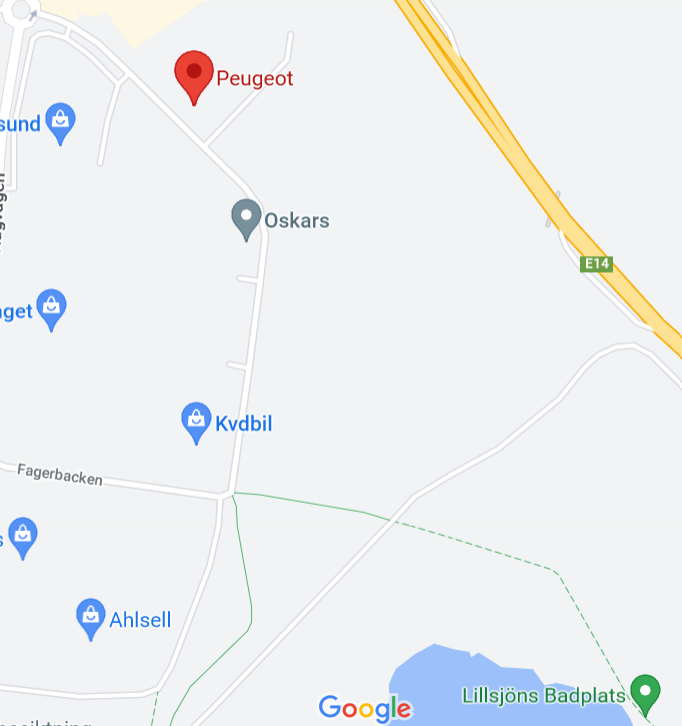
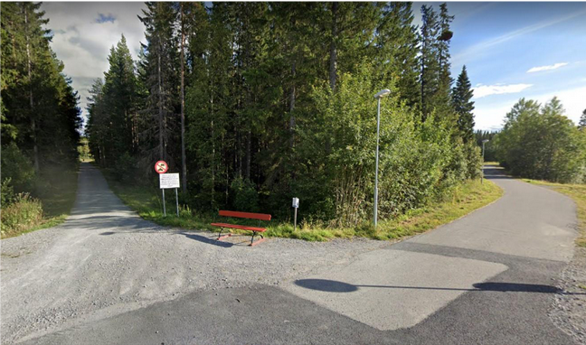
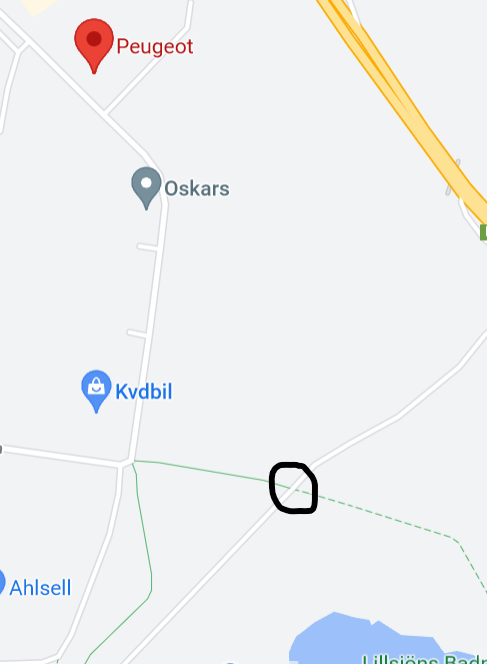
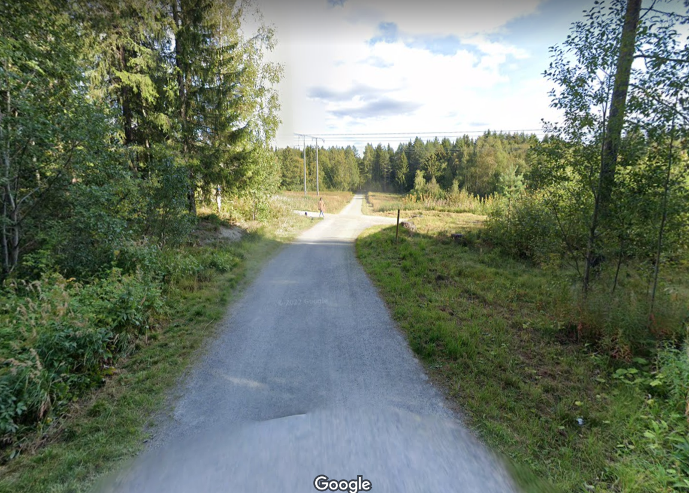
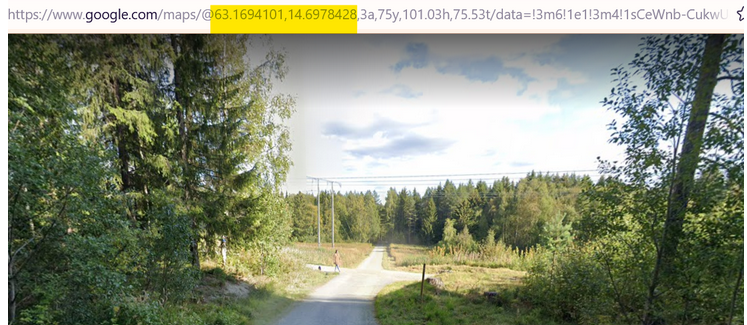

# Infiltrate the mob PART 2

## Challenge description
You arrive at the hotel and ask the receptionist whether a man by the name of Tommy Angelo has recently checked in or out from the hotel. The receptionist checks the booking system and can verify that the man you are looking for has already checked out.

Before leaving the hotel you gather all personal information that Mr Angelo used for booking the hotel room. It seems like Mr Angelo used one of his personal email address (Tommy.TGUN.Angelo@gmail.com).

Maybe you could trick Mr Angelo in believing that you are the courier for the drug deal and thereby make him hand out the coordinates.
Send an email to Mr Angelo and investigate the response you get. Set the subject of the email to "Coordinates for the courier".

Challenge:
Find the coordinates to the dropsite.

## Solution

In the challenge description we are told to send an email to Tommy.TGUN.Angelo@gmail.com
We get the following answer when emailing the suspect.

We open the attached PDF-file named dropsite. This file includes all the images and if followed they will show the route we are to take.

When looking through the different images within the PDF-file we can see that the third last images shows a Peugot sign in the top-left corner.

A quick google search tells us that there is only one Peugot car dealer in Östersund. Therefor we decide to drop our google street viewer outside the car dealer and follow the road further down the street.

Further down on the same road we can see the same intersection as shown in the second last image of the PDF. 

Now there is only one images left in the PDF, the dropsite. Which is most likely the intersection circled on the map. 

If we follow the narrow road to the left we should eventually reach the same spot. 

The coordinates can be retrieved in the URL header.

