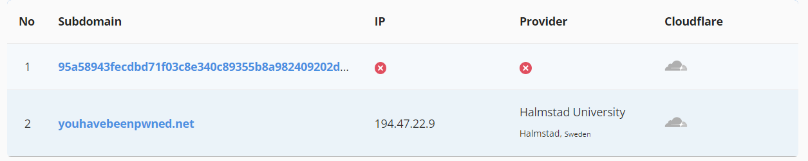
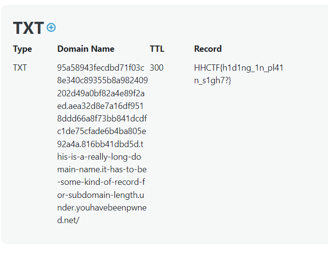
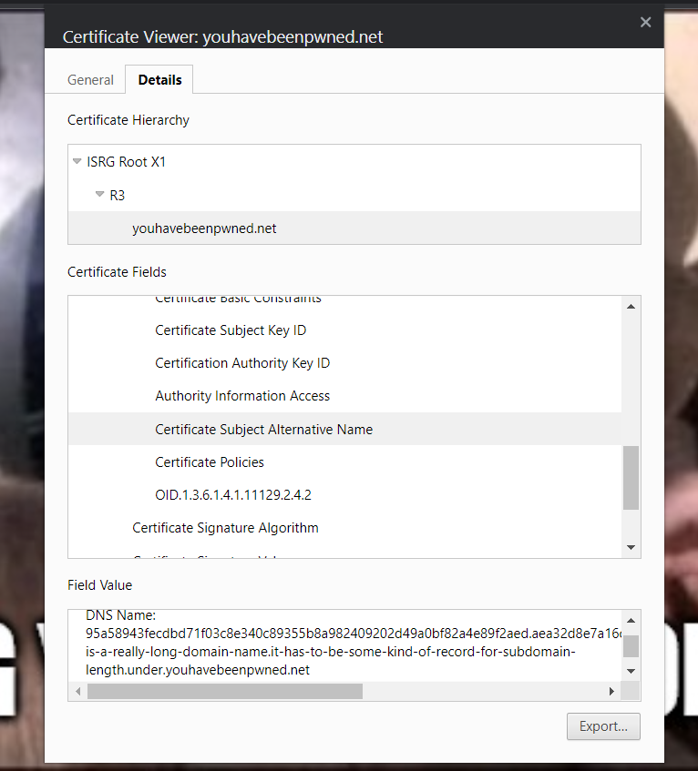

# Record

## Challenge description

I have A record for youhavebeenpwned.net, but I also have another record for something much longer.

## Solution

The capital A in the description suggests this has to do with dns. If we should look for something longer, this might refer to a subdomain. A google search for subdomain finder gives us a tool to use: https://osint.sh/subdomain/, where we can find a really long record, but it doesn't point to an ip address. 

By using a different tool, (e.g. https://dnschecker.org/all-dns-records-of-domain.php) we can enumerate all the different records, and finds the flag in the TXT record.

Flag: `HHCTF{h1d1ng_1n_pl41n_s1gh7?}`

## Alternative solution

As seen above, the `youhavebeenpwned.net` domain points to an ip-address. If we go to the domain using a web browser, we get a web page. The page itself doesn't contain anything useful, but if we have a look at the sites TLS certificate, the other subdomain is listed under Subject Alternative Name

