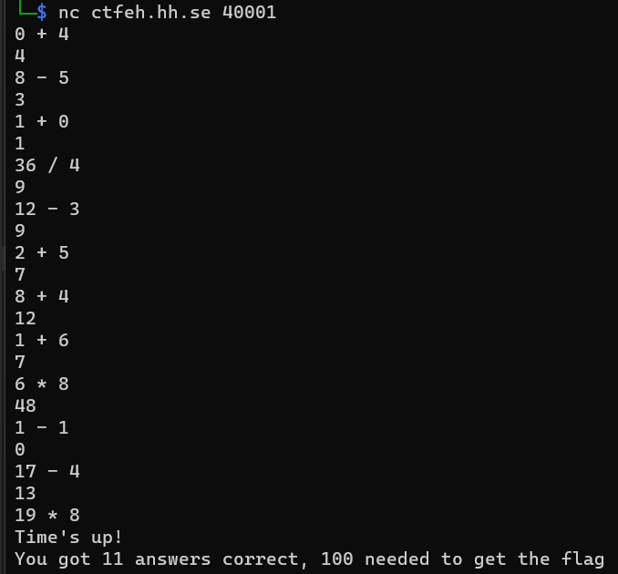
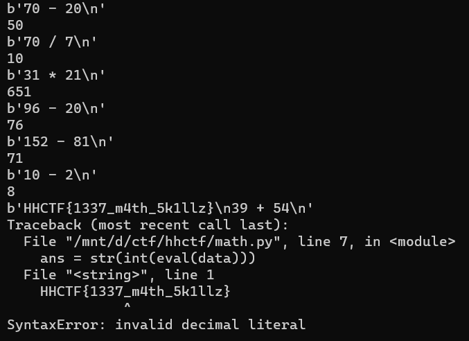

# Math 101

## Challenge description

How many math questions can you answer in 30 seconds?

## Solution

We are given a socket to connect to via netcat, however, we quickly realize we will never manually solve 100 tasks in 30 seconds



We have to write a script that connects to the socket and do the calculations. We can use python's `eval` function to evaluate the received data as python code, which should get the us the answer.

```python
import socket

conn = socket.create_connection(('ctfeh.hh.se', 40001))

while data := conn.recv(32):
    print(data)
    ans = str(int(eval(data)))
    print(ans)
    conn.send(bytes(ans, 'ascii') + b'\n')
```
The program will throw an error when trying to `eval` the flag, but that doesn't matter as long as we get it.



Flag: `HHCTF{1337_m4th_5k1llz}`